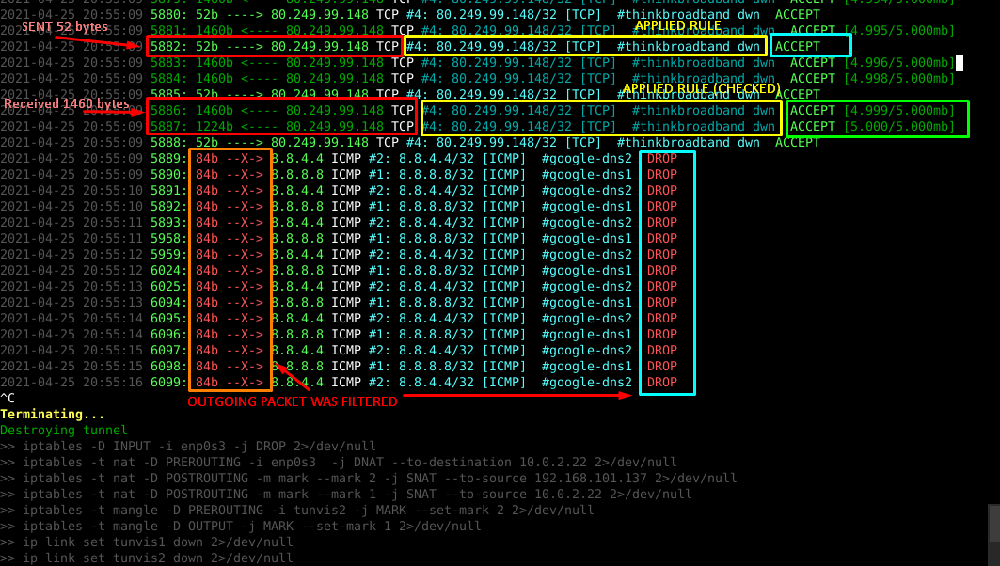

# Linux Network Limiter

## Description

* Limits access to specified addresses by download size or time span
* Creates tunnel using TUN interface




## Demo

https://youtu.be/sLjPGN29ssI

## Requirements

* OS: Linux (Debian)
* Programming language: C++17
* Compiler: g++ (Debian 8.3.0-6)
* Root/sudo permission


## Compile / Run
```
$ make
$ sudo ./tunvis ./dat/rules1.txt
# or
$ sudo ./tunvis --interface eth0 ./dat/rules1.txt
```


## Filter Rules

Sample rules file:
```
8.8.8.8/24         ICMP  10s   # google-dns1
8.8.4.4/24         ICMP  1,5kb # google-dns2
80.249.106.141/32  TCP   5kb   # thinkbroadband.com
80.249.99.148/32   TCP   5mb   # thinkbroadband dwn
# 1.2.3.4/8        UDP   1h    # commented/inactive
```
Columns:
1) address  (CIDR notation)
2) protocol (ICMP/TCP/UDP)
3) limit    (size: b/kb/mb/gb/tb or time: s/m/h)
4) comment
* Rules are overwritten by later lines
* Decimal number separator must be comma (bug)


## Notes

* IP header is subtracted from download size calculations
* TCP header size is subtracted (TCP only)
 

## Routing

```
$ echo 1 > /proc/sys/net/ipv4/ip_forward
$ echo 0 > /proc/sys/net/ipv4/conf/tunvis1/rp_filter
$ ip link set tunvis1 up
$ ip link set tunvis2 up
$ ip addr add 10.0.1.1/24 dev tunvis1
$ ip addr add 10.0.2.2/24 dev tunvis2
```


### Output

```
                  (snat-1) 
                    v
APP -> OUTPUT -> POSTROUTING -------------------> direct rooute --------------------- [eth0] --> INTERNET
         ^           \                                                               /  (192.168.x.x)
     (mark-1)         -> [tunvis1] == TunVisApp ==> [tunvis2] -> PRE -> FWD -> POST -
     ( =>fwmark-1)           ^                          ^         ^             ^
                       (10.0.1.1/24)              (10.0.2.2/24) (mark-2)      (snat-2)
```
```
$ ip rule add fwmark 1 table 1                //fwmark-1
$ ip route add table 1 default via 10.0.1.1   //fwmark-1

$ iptables -t mangle -A OUTPUT -j MARK --set-mark 1                  //mark-1
$ iptables -t mangle -A PREROUTING -i tunvis2 -j MARK --set-mark 2   //mark-2
$ iptables -t nat -A POSTROUTING -m mark --mark 1 -j SNAT --to-source 10.0.2.22    //snat-1
$ iptables -t nat -A POSTROUTING -m mark --mark 2 -j SNAT --to-source 192.168.x.x  //snat-2
```
    

### Input

```
                     <-- [tunvis1] <== TunVisApp == [tunvis2] <--
                    /         ^                         ^        \
                   /    (10.0.1.1/24)           (10.0.2.2/24)    POSTROUTING
                  /                                                \
             PREROUTING                                            FORWARD
                /                                   (drop-1)         \
APP <- INPUT <--------------------- direct rooute <---|||------- PREROUTING <-- [eth0] <-- INTERNET
                                                                    (dnat-1)    (192.168.x.x)
```
```
$ iptables -t nat -A PREROUTING -i eth0 -j DNAT --to-destination 10.0.2.22  //dnat-1
```
```
# Close direct route
$ iptables -I INPUT -i eth0 -j DROP  //drop-1
```
